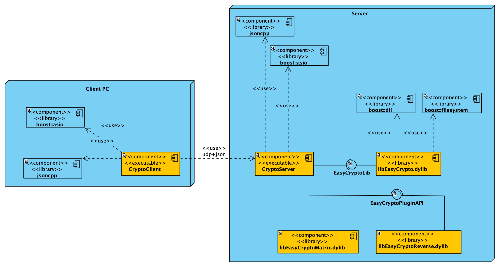
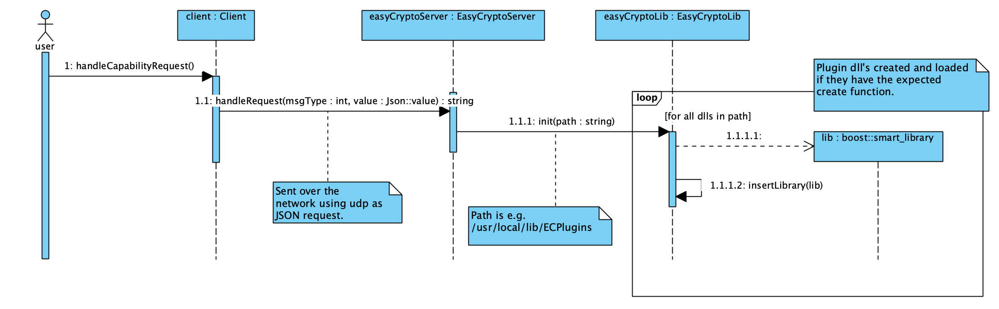

# EasyCrypto #

The EasyCrypto system demonstrates:

1. a shared plugin dll library implemented using Boost.DLL,
2. a client/server system using UDP protocol to exchange JSON messages for encrypt/decrypt,
3. API design, both in library and over the network.

Each plugin dll implements one encryption/decryption method. Plugins can be added to the system without rebooting it.

Notice that this is developed for *educational* purposes only. No real encryption is implemented nor designed into the system. No security or other essential non-functional requirements have been considered.

Current version has been tested on macOS 10.14 only. Earlier version has been tested to work on Ubuntu also. Since based on standard C++, boost and build using CMake, the system should be relatively easy to build and run on Windows too.

This [YouTube video](https://youtu.be/zBy_anMAVbA) demonstrates how you can add functionality to a running server by dropping a new plugin dll in the directory where plugins are located.


## Dependencies

* Boost-system library, using Boost 1.70 or newer.
* jsoncpp

Download and install [boost](https://boost.org) and build the system library at least (1.69 or newer do not require this). See instructions from Boost readme. Basically you must 1) run the boostrap command and then 2) the b2 command. After this, 3) run b2 again with sudo and install to install boost headers and libs in the usual place `/usr/local/include` and `/usr/local/lib`. 

Note that when using Boost 1.69 or newer, building the system library is no longer needed.

Get jsoncpp from github in the root dir of your workspace (*not* in EasyCrypto directory):

```
git clone https://github.com/open-source-parsers/jsoncpp
```

Then run the amalgamate.py script and install (from the generated `dist`directory) the header subdirectory `json` to `/usr/local/include` and copy the `jsoncpp.cpp` file both to the Client and Server directories of EasyCrypto project.

## Building EasyCrypto

Assuming you already have boost and jsoncpp installed (see Dependencies above), and [cmake](https://cmake.org) too.

First build the **library**:

1. cd EasyCryptoLib
2. mkdir build
3. cd build
4. cmake ..
5. make
6. sudo make install

After this the library is "published" to `/usr/local/include` and `/usr/local/lib` and can be used by the apps.

Then **build the plugin DLLs**, in their respective subdirectories (EasyCryptoMatrixPlugin and EasyCryptoReversePlugin). Plugin DLLs are installed to /usr/local/include/ECPlugins directory by default. Steps are the same as above with the "main" library.

Then **build the server**:

1. cd EasyCryptoServer
2. mkdir build
3. cd build
4. cmake ..
5. make

And then **build the client**

1. cd EasyCryptoClient
2. mkdir build
3. cd build
4. cmake ..
5. make

Basically you then have the installation pictured below, one one developer machine. Obviously, you can put the client and server with libraries in different machines.



After this, go to server build dir and start the server: `./CryptoServer 10000` listening to messages using port 10000. After this, start the client: `./CryptoClient localhost 10000`, providing the server address and port as a parameter.

Query the *capabilities* of the encryption server. It will reply with the supported encryption methods (currently "matrix" and "reverse"). Use them both to see how they work.

Remove either of the plugin dll:s from the /usr/local/lib/ECPlugins directory while the server is running. Then again query the supported methods. You can see that the server replied with one method missing. Put the dll back in the directory and again query the supported methods. 



Implmement additional new encryption methods using either matrix or reverse dll as an example. Install the plugin dll to see a new method taken into use.


## TODO

* Works on macOS and Ubuntu, check that also works on Windows. In Win 10 with Visual Studio dev tools should be easy since Visual Studio nowadays support bash shells and importing projects from cmake files.
* Modify the main and plugin dll libraries to use basic data types only for better binary compatibility across compilers and platforms. 
* Check if there are any issues with various char sets and languages.

## Who to talk to

(c) Antti Juustila 2019
